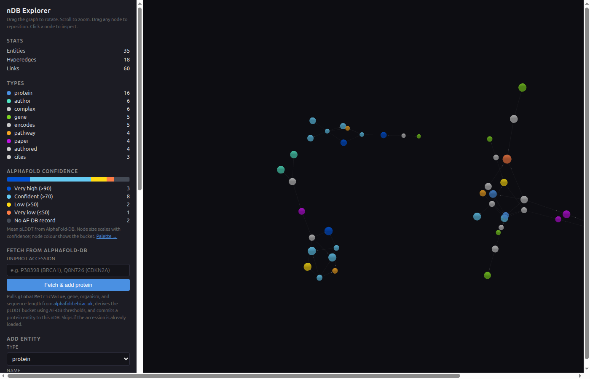
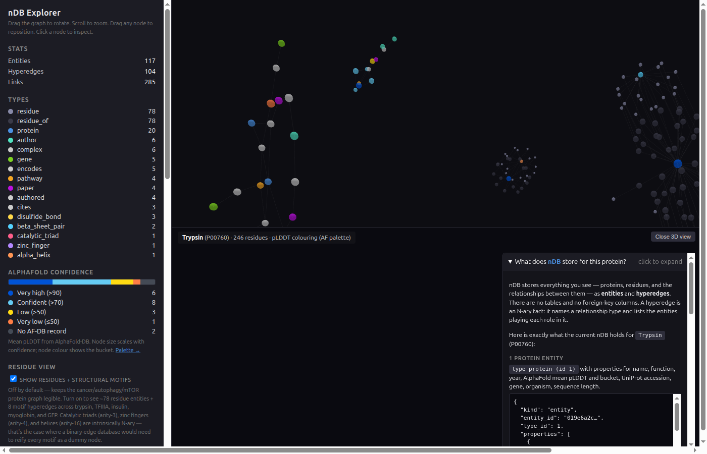

# alphafold_nDB

**A hyperedge-native protein-structure database, browsed in 3D.**

This directory is the science-facing landing for what the rest of the
repository calls "v2.2 of the nDB explorer." If you arrived because
you care about proteins and not databases, start here.

> ⚠ This is a research prototype. The data is curated for
> demonstration; the engine is real (and tested). Pull requests,
> issues, and "I tried this and it broke" emails very welcome.

---

## What this is

A single-page web app that lets you walk through structural biology
the way the database actually stores it:

- **15 cancer/autophagy/mTOR signalling proteins** seeded with real
  pLDDT confidence values fetched from
  [AlphaFold-DB](https://alphafold.ebi.ac.uk).
- **5 "showcase" small proteins** (trypsin, TFIIIA, insulin, myoglobin,
  GFP) with **per-residue entities** and **structural-motif hyperedges**
  — catalytic triads, zinc fingers, disulfide bonds, α-helices, β-sheet
  pairs.
- **Live AlphaFold-DB fetch** in the sidebar — paste any UniProt
  accession (e.g. `P38398` for BRCA1) and the entity lands in the
  graph with its real pLDDT.
- **AlphaFold 3D viewer** on the right (NGL Viewer + the canonical
  AF-DB palette) with **bidirectional click sync** to the hypergraph.

Click a catalytic-triad hyperedge in the graph → the three residues
glow in the 3D structure. Click a residue in the 3D canvas → that
residue's nDB entity is selected back in the hypergraph and signal-
flow particles light up through every motif it participates in.



---

## The 30-second tour

```sh
git clone https://github.com/goldrag1/nDB
cd nDB-ndimemsion-database
cargo run -p ndb-renderer --example v22_explorer
```

Open `http://127.0.0.1:9876/` in a browser.

1. **Drag** to rotate the 3D hypergraph. The 15 cancer/signalling
   proteins are colored by their AlphaFold pLDDT bucket — dark blue =
   very high confidence (KRAS, PIK3CA, LC3 — small structured
   domains), orange = very low (BRCA1's disordered N-terminus drags
   the whole-chain score to 41).
2. **Click any protein**. The sidebar shows its UniProt accession,
   gene, organism, sequence length, pLDDT mean, and which complexes
   and pathways it participates in.
3. **Hit "Load AlphaFold 3D structure"**. The right pane splits — the
   CIF loads from `alphafold.ebi.ac.uk` directly (no proxy, no
   account), coloured by per-residue pLDDT in the same palette.
4. **Toggle "Show residues + structural motifs"** in the sidebar. The
   graph grows by ~78 residue entities + 8 motif hyperedges. Click
   the trypsin **catalytic_triad** node — the three residues Ser195,
   His57, Asp102 glow as ball+stick in the 3D structure simultaneously.
5. **Open the "What does nDB store for this protein?" pane** at the
   bottom-right of the 3D view. It shows the actual entity + hyperedge
   records nDB is holding for this protein, with real wire-format JSON.



---

## Why "n-dimensional database"

Most graph databases connect two things at a time (a binary edge with
a type). Structural biology rarely fits that shape:

| Phenomenon            | True arity | What a binary-edge DB has to invent |
| --- | --- | --- |
| Catalytic triad       | **3**  | Reify a "triad" dummy node + 3 edges |
| C2H2 zinc finger      | **4**  | Reify a "finger" node + 4 edges |
| Disulfide bond        | 2      | (fine in both models)               |
| α-helix (15 residues) | **15** | Reify a "helix" node + 15 edges     |
| β-sheet pair          | **20** | Reify a "sheet" node + 20 edges     |
| Protein complex of N  | **N**  | Reify a "complex" node + N edges    |

In nDB you don't reify. The relationship **is** the record. A
catalytic_triad hyperedge has type `catalytic_triad`, arity 3, and
role-fillers `[Ser195, His57, Asp102]` — that's the whole story. The
3D explorer surfaces this directly: every hyperedge centroid in the
viz IS the database row, no decoder ring required.

---

## Data provenance

Every number in this demo can be traced back to a primary source.

| Item | Source |
| --- | --- |
| Mean pLDDT values for the 15 core + 5 showcase proteins | `https://alphafold.ebi.ac.uk/api/prediction/<acc>` field `globalMetricValue`, fetched May 2026 (model_v6). ATM (Q13315) and BRCA2 (P51587) return `{}` because AF-DB retired predictions for proteins >2700 aa; we mark them as "no AF-DB record". |
| Trypsin catalytic triad Ser195-His57-Asp102 | Hedstrom L. 2002. *Chem. Rev.* 102:4501. |
| TFIIIA finger-1 C2H2 (Cys6-Cys11-His24-His28) | Brown R.S. 2005. *FEBS Lett.* 579:1. |
| Insulin disulfide bonds A6-A11, A7-B7, A20-B19 | Steiner D.F. 1967. *PNAS* 57:473. |
| Myoglobin F-helix (residues 80-95) | Phillips S.E.V. 1980. *J. Mol. Biol.* 142:531. |
| GFP β-barrel + chromophore Thr65-Tyr66-Gly67 | Ormö M. et al. 1996. *Science* 273:1392. PDB 1EMA. |

The Rust seed module documenting each citation lives at
[`crates/ndb-renderer/examples/v22_explorer/residues.rs`](../../crates/ndb-renderer/examples/v22_explorer/residues.rs).

---

## What a scientist can do in 30 seconds

The shipped demo is designed so a user with no nDB background can
get something useful out of it before they have to read anything:

1. **Look up a protein by UniProt accession** — type it in the
   sidebar; the pLDDT mean + bucket + organism + gene symbol
   commit straight into the database. Try `P00533` (EGFR),
   `P10275` (androgen receptor), `Q9UNQ0` (ABCG2).
2. **Compare confidence distributions visually** — a protein at
   pLDDT 92 draws ~2× the radius of one at 50. The mini-bar in the
   sidebar shows the bucket spread across whatever proteins are
   currently loaded.
3. **See AlphaFold for one of your favorites in two clicks** —
   click the protein node, hit Load 3D. The whole structure is
   coloured by per-residue confidence in the canonical AF palette.
4. **See the exact catalytic-triad geometry** — load Trypsin, turn
   on residues, click the `catalytic_triad` hyperedge. Ser195's OH,
   His57's imidazole, and Asp102's carboxylate light up together
   in 3D.
5. **Read what the database is actually storing**, in plain language,
   in the floating "What does nDB store?" pane. There's no
   table-schema between you and the records.

If you spend 30 minutes on it instead of 30 seconds, you can
**extend the residue dataset** — copy one of the `ResidueDataset`
constants in `residues.rs`, pin in your favorite motif, recompile.
The tests assert arity expectations so you'll get a clear failure
if the dataset shape drifts.

---

## What this is NOT

- **Not a replacement for the PDB or AF-DB.** Treat the local nDB as
  a working set you stage data into, not as a primary source of
  record.
- **Not full-proteome.** The curated set is ~20 proteins by design,
  to keep the demo legible. The live-fetch form lets you grow it
  arbitrarily; the engine itself scales to millions of entities.
- **Not multimer-aware.** The complex hyperedges treat proteins as
  monomeric subunits. AlphaFold-Multimer's ipTM scores aren't
  loaded — we use a `0.8 × mean + 0.2 × min` proxy from per-chain
  pLDDT to give complexes a synthesised confidence value.
- **Not validated for clinical or production use.** This is a
  research prototype, period.

---

## Where the code lives

| Component | Path |
| --- | --- |
| Rust seed binary (engine setup + servers) | [`crates/ndb-renderer/examples/v22_explorer/main.rs`](../../crates/ndb-renderer/examples/v22_explorer/main.rs) |
| Curated residue + motif dataset             | [`crates/ndb-renderer/examples/v22_explorer/residues.rs`](../../crates/ndb-renderer/examples/v22_explorer/residues.rs) |
| Web app (hypergraph + NGL + model pane)     | [`docs/explorer/index.html`](../explorer/index.html) |
| nDB engine (storage, MVCC, query, indexes)  | [`crates/ndb-engine/`](../../crates/ndb-engine) |

The web app is intentionally a single HTML file — no npm, no bundler,
no build step. CDN imports for `3d-force-graph` and `NGL Viewer`.

---

## Reproducibility

```sh
# Verify every test from this work passes:
cargo test -p ndb-renderer --example v22_explorer
# expected: 8 passed; 0 failed
#   trypsin catalytic triad arity 3
#   TFIIIA zinc finger arity 4
#   insulin three disulfide bonds
#   myoglobin F-helix arity 16
#   GFP two beta-sheet pairs
#   pLDDT bucket thresholds match AF-DB
#   20 protein AF_SEED has consistent metadata
#   seeded engine has the expected property counts

# Spin up the explorer:
cargo run -p ndb-renderer --example v22_explorer
# Then open http://127.0.0.1:9876/

# Re-fetch the pLDDT values yourself (works from any IP — EBI's
# CORS allows any origin):
curl -s https://alphafold.ebi.ac.uk/api/prediction/P04637 | jq '.[0].globalMetricValue'
# → 75.06  (P53 — drag is the disordered N+C tails)
```

The engine state lives at `/tmp/v22-explorer-ndb`. It's rebuilt fresh
on every example launch — if you want to keep edits across restarts,
modify the cleanup line in `main.rs` or use a different `DB_PATH`.

---

## Citation

If this demo is useful in your work, please cite the underlying
AlphaFold paper for the structures, plus this repository for the
hyperedge data model:

- Jumper J. et al. 2021. *Nature* 596:583. (AlphaFold)
- Varadi M. et al. 2024. *Nucleic Acids Research* 52:D368. (AlphaFold-DB)
- nDB: <https://github.com/goldrag1/nDB>

---

## Contact

Bugs, ideas, datasets you want curated next: open an issue at
<https://github.com/goldrag1/nDB/issues>. PRs welcome — the residue
dataset in particular is straightforward to extend; add your favorite
motif following the patterns in `residues.rs` and the assertion-based
tests will catch any structural slip.

Licensed under Apache-2.0.
