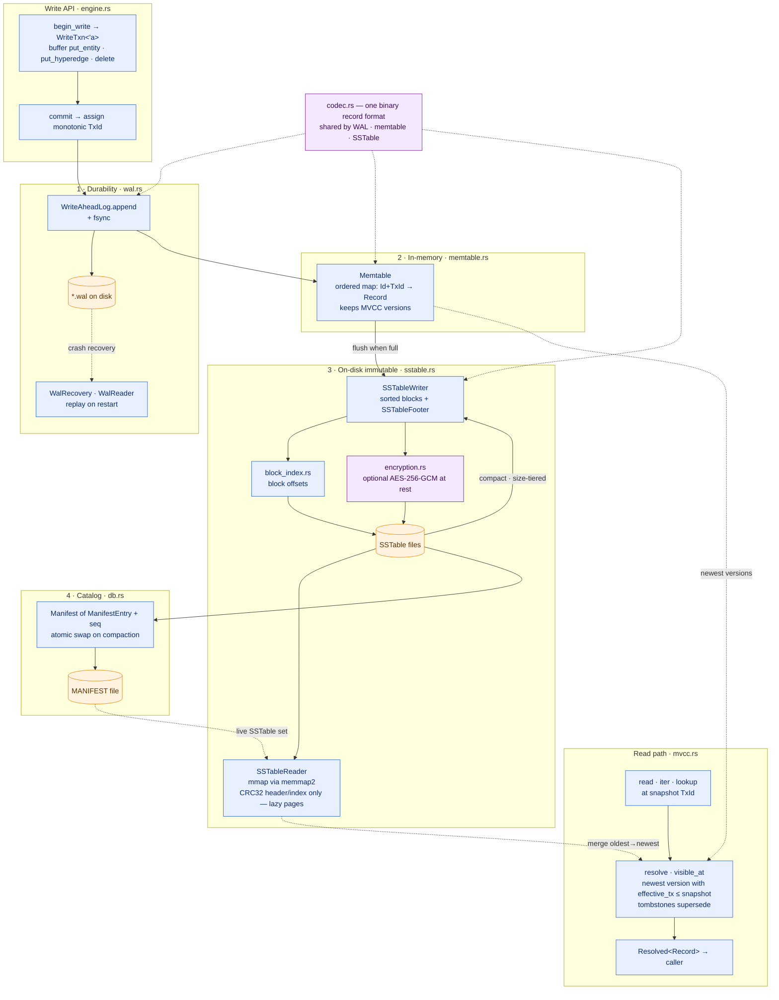

# nDB Engine — LSM Storage Core

The `ndb-engine` crate is a self-contained, `unsafe`-free, append-only
log-structured merge (LSM) store. This diagram traces a write from
`commit()` through the WAL into the memtable, its flush to immutable
mmap'd SSTables, size-tiered compaction catalogued by the manifest, and
the snapshot read path resolved through MVCC.

Source: `crates/ndb-engine/src/` — `wal.rs`, `memtable.rs`, `sstable.rs`,
`block_index.rs`, `db.rs` (manifest), `mvcc.rs`, `codec.rs`,
`encryption.rs`.

## Reading the diagram

- **Write order is durability-first.** `commit()` assigns a monotonic
  `TxId`, the WAL appends + `fsync`s *before* the mutation enters the
  memtable, so a crash replays from `*.wal` (`WalRecovery`).
- **The memtable is the only mutable structure.** It holds MVCC versions
  keyed by `(Id, TxId)`; once full it flushes to an immutable SSTable.
- **SSTables are append-only and mmap'd.** `SSTableReader` CRC-checks only
  the footer/block index, leaving entry pages to lazy fault-in
  (`memmap2`) — this is what keeps RSS bounded on 10 GB+ datasets.
  Encryption at rest (`AES-256-GCM`) is an optional layer on the same file.
- **Compaction is size-tiered** and re-enters the same `SSTableWriter`;
  the `Manifest` catalogues the live set and is swapped atomically.
- **Reads are lock-free snapshots.** `mvcc::resolve()` merges the memtable
  and the SSTable set oldest→newest, keeping the newest version with
  `effective_tx ≤ snapshot` and honouring tombstones — enabling
  time-travel to any past `TxId`.
- **`codec.rs` is the single binary record format** shared across WAL,
  memtable, and SSTable, so encoding is identical end to end.
