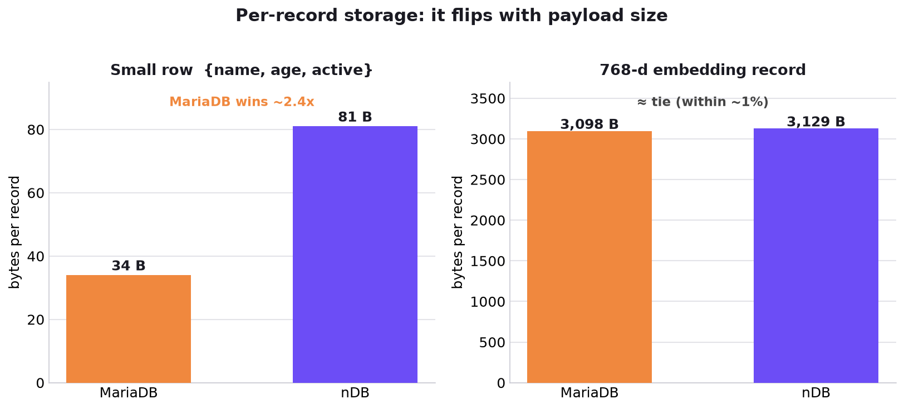
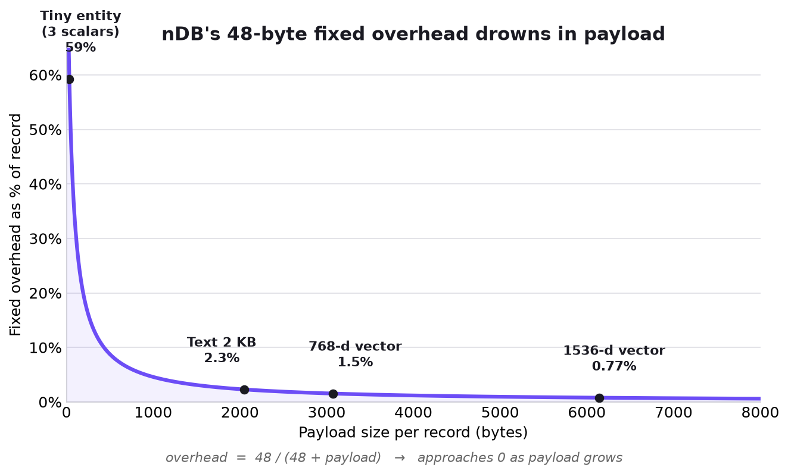
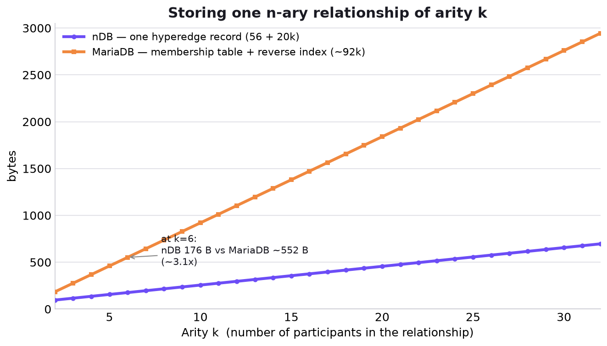
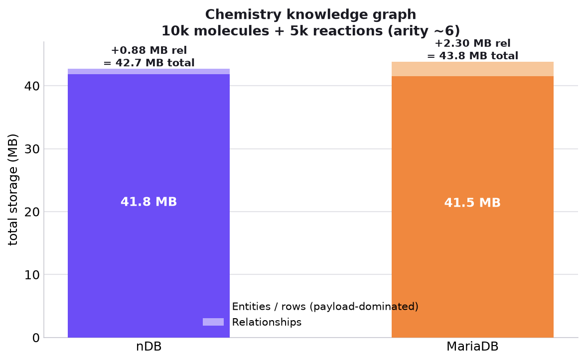

# Is an nDB entity really "heavier" than a SQL row?

> A byte-level storage cost analysis, taken straight from nDB's on-disk format
> (`crates/ndb-engine/src/record.rs`, `value.rs`, `codec.rs`) and InnoDB/MariaDB's
> DYNAMIC row format. Ready to share.

## TL;DR

- **Small records (a few bytes of data):** MariaDB is clearly leaner — ~34 B vs ~81 B (~2.4×).
- **Large records (vectors, biological sequences, blobs):** nDB's fixed 48-byte overhead
  vanishes — the two land **within ~1.5% of each other**.
- **Once you count multi-dimensional (n-ary) relationships:** **nDB wins**, and the margin
  **grows with the arity of the relationship** — from a tie (binary) up to **~3.4×** (arity 1500).

In one line: nDB pays a fixed "tax" in exchange for global UUIDs, a flexible schema, bitemporal
MVCC time-travel, and **native n-ary relationships**. That tax *hurts when you store a few bytes*
(MariaDB's home turf) and *disappears when you store kilobytes of scientific data with complex
relationships* (nDB's home turf).

---

## 1. How MariaDB (InnoDB) stores a row

DYNAMIC row format, inside a 16KB page in the clustered B+tree index:

| Component | Size |
|---|---|
| Record header (next-ptr, flags, heap no) | 5 B fixed |
| Variable-length field array | 1–2 B / var-len column |
| NULL bitmap | 1 bit / nullable column |
| `DB_TRX_ID` (MVCC) | 6 B |
| `DB_ROLL_PTR` (undo log) | 7 B |
| `DB_ROW_ID` (only when no PK) | 6 B |
| Column data | exact type size, **no tag, no column name** |

**Fixed overhead ≈ 18 B/row** (5 + 6 + 7) with a user PK. Column names & types live in the data
dictionary; the checksum is computed **per page** (amortized over hundreds of rows); old MVCC
versions live in the undo log and get purged — the main table keeps only the latest version.

## 2. How nDB stores an entity

Each entity is an append-only `EntityRecord` (LSM-tree), sharing a common envelope:

```text
┌─────────────┬──────────┬────────────────┬───────────── payload ─────────────┬───────┐
│ record_size │ rec_kind │ format_version │ entity_id │ type_id │ tx_assert/...  │ crc32 │
│   u32 = 4B  │  u8 = 1B │    u8 = 1B     │ UUID 16B  │ u32 4B  │ 2×u64 = 16B    │  4B   │
└─────────────┴──────────┴────────────────┴───────────────────────────────────┴───────┘
```

| Component | Size |
|---|---|
| Envelope (size + kind + version + CRC32) | 10 B |
| `entity_id` (UUID v7) | 16 B |
| `type_id` | 4 B |
| `tx_id_assert` + `tx_id_supersede` (bitemporal MVCC) | 16 B |
| Property count (u16) | 2 B |
| **Fixed total** | **48 B** |
| Per property | `PropertyId` 4B + tag 1B + value |

Property names are **not** repeated per entity — nDB uses a dictionary (`PropertyKeyRecord`
maps `u32 ↔ name`, written once), exactly like InnoDB's data dictionary.

## 3. Head-to-head — a small record

`{name: "Alice", age: 30, active: true}`

- **nDB:** 48 (header) + 14 (name) + 13 (age) + 6 (active) = **~81 B**
- **InnoDB:** 5 (header) + 1 (var-len) + 1 (null bitmap) + 13 (MVCC) + 14 (data) = **~34 B**

➡️ For a small row, **MariaDB is ~2.4× leaner**. This is relational's home turf — and **not** the
workload nDB targets.



## 4. When payload drowns the overhead

nDB's header is a **constant 48 B**; payload grows linearly, so
`overhead = 48 / (48 + payload)`:



| Case | Total record | 48 B is |
|---|---|---|
| Small entity (3 scalars) | 81 B | **59%** 🔴 |
| 2 KB text field | 2,105 B | **2.3%** |
| 768-d embedding (f32) | 3,129 B | **1.5%** |
| 1536-d embedding (OpenAI) | 6,201 B | **0.77%** |
| 10 kbp DNA sequence (2-bit packed) | ~2,557 B | **1.9%** |
| 50 KB thumbnail | ~51,257 B | **0.09%** 🟢 |

In this regime an InnoDB row storing a 768-d embedding must use a `BLOB` too:
**~3,098 B (InnoDB) vs 3,129 B (nDB) — a ~1% gap.** "Who is heavier" becomes almost meaningless.

## 5. The deciding factor: multi-dimensional relationships

Once the payload ties out, the real cost is in storing the **relationships**.

**nDB — one `HyperEdgeRecord` for the whole relationship:**

```text
Fixed = 56 B   (envelope 10 + hyperedge_id 16 + type_id 4 + 2×tx_id 16
                + entity_arity 4 + hyperedge_arity 4 + prop_count 2)
Per participant (role) = role_id 4 + UUID 16 = 20 B
→ Arity-k relationship = 56 + 20k B, in ONE contiguous record.
```

**MariaDB — no native n-ary relationship** → you're forced into a membership (EAV) table where
each participant is **one row** `(edge_id, role, member_id)`:

| / participant | BIGINT keys | UUID keys (fair vs nDB) |
|---|---|---|
| Base row (header 5 + trx 13 + data) | ~36 B | ~52 B |
| Reverse index on `member_id` | ~25 B | ~40 B |
| **Per participant** | **~60 B** | **~92 B** |

➡️ **nDB: 20 B/participant — MariaDB: ~60–92 B/participant (~4.6×).**



### End-to-end example: a chemistry knowledge graph

10,000 molecules (each with a 1024-d embedding = 4 KB + a few scalars), 5,000 reactions, each
relating on average 6 molecules by role.

| | nDB | MariaDB |
|---|---|---|
| Entities / rows (payload-dominated) | 41.8 MB | 41.5 MB |
| Relationships | **0.88 MB** | **~2.3 MB** |
| **Total** | **≈ 42.7 MB** | **≈ 43.8 MB** |

The entity side is basically a tie; the entire gap comes from the relationship layer (**~2.6×**).



### Higher arity → nDB wins bigger

A protein that "contains" 1,500 atoms — a single hyperedge of arity 1,500:

| | nDB | MariaDB |
|---|---|---|
| Storage | **30 KB, 1 record** | **~102 KB, 1,500 scattered rows** |
| Reading the whole relationship | 1 sequential seek | 1,500 B+tree lookups |

➡️ **~3.4× less storage** and far better locality.

## 6. Why (the underlying reason)

1. **Structural mismatch:** SQL only has binary relationships (FKs). An n-ary relationship gets
   shredded into k rows → paying header + MVCC + **index duplication** for *every* participant.
   nDB folds the whole relationship into one record where each participant is a packed 20-byte slot.
2. **Index amplification:** every relational index entry repeats the PK, scaling with participant
   count. nDB only indexes the hyperedge_id — it never duplicates each role.
3. **Locality:** nDB reads an arity-1,500 relationship as one sequential record; InnoDB jumps 1,500
   times through the B+tree.

## 7. Being fair

- **Pure binary relationship (arity 2):** roughly a tie; if MariaDB uses BIGINT PKs it's even a
  bit leaner than nDB. nDB only clearly wins from **arity ≥ 3** or with variable arity.
- **nDB has its own indexes too** — not entirely "free" — but the relationship's base record stays
  at 20 B/role, not a heavyweight membership row.
- **If history matters:** nDB keeps old versions on disk (until compaction + retention policy
  handle them); MariaDB purges the undo log. But if you need audit/time-travel in MariaDB you must
  build a history table yourself — and then it costs *more* than nDB.

## Conclusion

| Scenario | Who's leaner |
|---|---|
| Small record, a few bytes of data | **MariaDB** (~2.4×) |
| Large payload (vector / blob / sequence) | **Tie** (< 1.5% apart) |
| Counting binary relationships | Tie → MariaDB slightly ahead |
| Counting n-ary relationships (arity ≥ 3) | **nDB** (2.6× → 3.4×) |

nDB doesn't "compress better." It wins because **the data model fits the problem**: relational is
forced to shred an n-ary relationship into many rows + indexes, while nDB packs it into a single
hyperedge. On the right data — scientific, vector, multi-dimensional relationships — the "48-byte
tax" doesn't just disappear, it's paid back with interest.

---

*Analysis based on the nDB engine on-disk format (v3) and InnoDB's DYNAMIC row format. Numbers are
byte-level estimates meant to illustrate orders of magnitude, not a micro-benchmark. Charts
regenerable via `docs/assets/gen_storage_charts.py`.*

<!--
LinkedIn caption (copy-paste):

Is an nDB entity heavier than a SQL row? I did the byte-level math. 🧵

Small rows? MariaDB wins ~2.4×. No contest.
Big rows (vectors, sequences, blobs)? Dead tie — within ~1%.
But once you count n-ary relationships, it flips: nDB wins 2.6×–3.4×, and the gap grows with
how many things the relationship connects.

The reason isn't compression. It's the data model. SQL has no native n-ary relationship, so it
shreds one relationship into k rows + duplicated indexes. nDB folds the whole thing into a single
hyperedge record — 20 bytes per participant.

Full breakdown + charts 👇

#databases #datastructures #knowledgegraph #vectordatabase #storageengine #rustlang
-->
